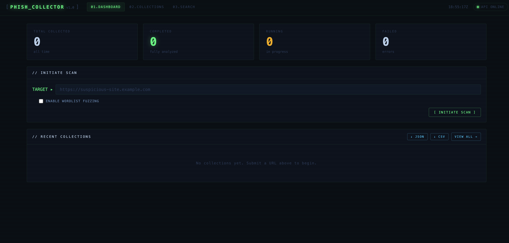
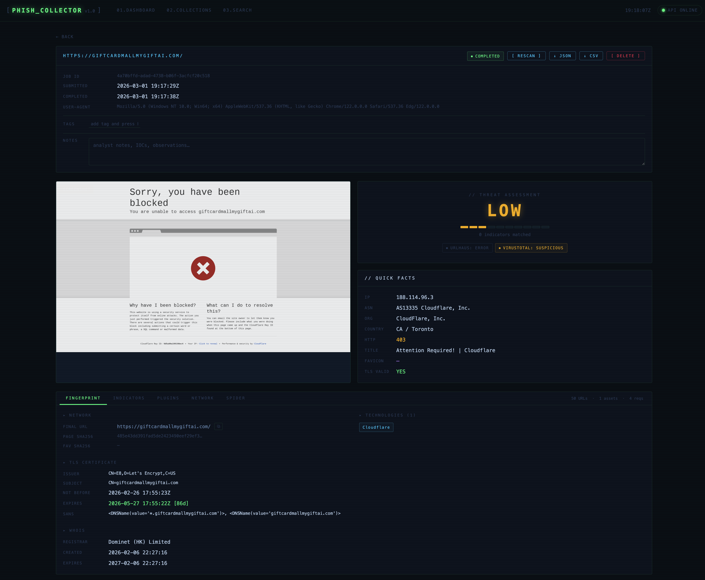

# PhishCollector

PhishCollector is a **research framework** for collecting, analysing, and tracking phishing sites.  It is intentionally designed as a starting point — the detection rules, technology signatures, wordlists, and plugins are all plain data structures that researchers are expected to read, extend, and adapt to their own threat landscape.

Submit a suspicious URL and PhishCollector will:

- Load the page in a **headless Chromium browser** (JavaScript enabled, random User-Agent, stealth anti-bot measures)
- Capture the **fully-rendered HTML**, a **full-page screenshot**, and every **network request**
- Download all linked **JavaScript and CSS** assets
- **Fingerprint** the site: IP/ASN/geo, TLS certificate, WHOIS, tech stack, favicon hash (Shodan-compatible mmh3), form analysis, phishing indicator detection
- **Spider** discovered links, robots.txt paths, and sitemap URLs (optional wordlist fuzzing)
- Query **URLhaus** and/or **VirusTotal** for threat reputation
- Store everything in **PostgreSQL** for cross-collection searching and trend analysis

All results are accessible via a **REST API**, a **web dashboard**, and a **CLI**.

---

## Screenshots





---

## Quick start

```bash
cp .env.example .env          # configure (see below)
docker compose up --build     # starts db + app + frontend
```

| Service  | URL                          |
|----------|------------------------------|
| GUI      | http://localhost:3000        |
| API docs | http://localhost:8000/docs   |
| DB       | localhost:5432               |

---

## Configuration

All settings are environment variables with the `PHISH_` prefix.  Copy `.env.example` to `.env` and adjust.

| Variable | Default | Description |
|---|---|---|
| `PHISH_DATABASE_URL` | postgres://… | PostgreSQL DSN |
| `PHISH_API_KEY` | *(empty)* | If set, all requests require `X-API-Key: <value>` |
| `PHISH_DATA_DIR` | `/data` | Storage root for screenshots, HTML, assets |
| `PHISH_BROWSER_TIMEOUT` | `30000` | Page-load timeout in ms |
| `PHISH_REQUEST_TIMEOUT` | `15` | HTTP sub-request timeout in seconds |
| `PHISH_MAX_SPIDER_PAGES` | `50` | Max URLs the spider visits per job |
| `PHISH_MAX_ASSET_SIZE` | `10485760` | Max JS/CSS file size to store (bytes) |
| `PHISH_PROXY_URL` | *(empty)* | Outbound proxy — see below |
| `PHISH_PROXY_SSL_VERIFY` | `true` | Set `false` for intercepting proxies — see below |
| `PHISH_URLHAUS_ENABLED` | `false` | Enable URLhaus reputation check |
| `PHISH_VIRUSTOTAL_API_KEY` | *(empty)* | VirusTotal v3 API key (leave empty to disable) |

---

## Proxy setup

Routing all outbound traffic through a proxy keeps your analyst IP hidden from the phishing server.

### Tor (anonymisation)
```dotenv
PHISH_PROXY_URL=socks5://127.0.0.1:9050
PHISH_PROXY_SSL_VERIFY=true   # Tor does not intercept TLS
```

### Burp Suite (traffic inspection)

Burp acts as a TLS man-in-the-middle and presents its own CA certificate for every HTTPS connection.  Without disabling SSL verification every HTTPS request through the proxy will fail.

```dotenv
PHISH_PROXY_URL=http://127.0.0.1:8080
PHISH_PROXY_SSL_VERIFY=false  # required for Burp / intercepting proxies
```

> **Note:** `PHISH_PROXY_SSL_VERIFY=false` only affects outbound HTTPS connections made by the Python backend (plugins, fingerprinter, spider).  The Playwright browser already operates with `ignore_https_errors=true` regardless of this setting.

> **Warning:** Never set `PHISH_PROXY_SSL_VERIFY=false` without a proxy configured — it would disable certificate validation for all external API calls (URLhaus, VirusTotal).

---

## REST API

Base path: `/api/v1`

| Method | Path | Description |
|--------|------|-------------|
| `POST` | `/collections` | Submit a URL for collection |
| `GET` | `/collections` | List all collections |
| `GET` | `/collections/{id}` | Full detail + fingerprint |
| `GET` | `/collections/{id}/screenshot` | Full-page PNG |
| `GET` | `/collections/{id}/html` | Captured HTML (downloaded as plain-text) |
| `GET` | `/collections/{id}/requests` | Network request log |
| `GET` | `/collections/{id}/spider` | Spider results |
| `GET` | `/collections/{id}/plugins` | Threat-intel plugin results |
| `POST` | `/collections/{id}/plugins/refresh` | Re-run plugins (e.g. fetch pending VT result) |
| `POST` | `/collections/{id}/rescan` | Re-collect the same URL (original is preserved) |
| `PATCH` | `/collections/{id}` | Update tags and notes |
| `GET` | `/collections/{id}/export?format=json\|csv` | Export collection data |
| `DELETE` | `/collections/{id}` | Delete a collection and all its artifacts |
| `GET` | `/search` | Search fingerprints by IP, favicon hash, technology, country, title |

Full interactive docs at `/docs` (Swagger UI).

### Submit a scan

```bash
curl -X POST http://localhost:8000/api/v1/collections \
  -H 'Content-Type: application/json' \
  -d '{"url": "https://suspicious-site.example.com", "use_wordlist": true}'
```

---

## CLI

```bash
# Install (inside container or local venv with requirements.txt)
pip install -e .

# Submit a URL and wait for completion
phishcollector collect https://target.example.com --wait

# With wordlist fuzzing
phishcollector collect https://target.example.com --wordlist --wait

# List recent jobs
phishcollector list

# View full detail
phishcollector detail <job-id>

# Download screenshot
phishcollector screenshot <job-id> -o capture.png

# Search by tech stack / favicon hash / country
phishcollector search --tech WordPress --country RU
phishcollector search --favicon-hash -1234567890
```

---

## Threat intelligence plugins

### URLhaus (abuse.ch)
Free, no API key required.

```dotenv
PHISH_URLHAUS_ENABLED=true
```

### VirusTotal
Requires a free or paid API key from [virustotal.com](https://www.virustotal.com).

```dotenv
PHISH_VIRUSTOTAL_API_KEY=<your-key>
```

When a URL has not yet been analysed by VT, PhishCollector submits it for scanning and automatically re-fetches the result every 30 seconds until it resolves.

### Adding your own plugins

Each plugin is a single file in `phishcollector/plugins/` that exposes one async function:

```python
# phishcollector/plugins/myplugin.py
from . import CheckResult

async def check(url: str, proxy_url=None, ssl_verify=True) -> CheckResult:
    # query your feed / API here
    return CheckResult(
        plugin_name="myplugin",
        status="malicious",   # malicious | suspicious | clean | unknown | error
        score=0.95,           # 0.0–1.0, or None
        result={"raw": ...},  # stored as JSONB, displayed in the GUI
    )
```

Then register it in `phishcollector/plugins/runner.py`:

```python
from .myplugin import check as myplugin_check
tasks.append(myplugin_check(url, proxy_url=settings.proxy_url, ssl_verify=settings.proxy_ssl_verify))
```

No other changes are needed — the result is automatically stored, displayed in the dashboard, and factored into the threat score.

---

## Customising phishing indicators

The detection engine is intentionally kept as **plain, readable data** so researchers can tune it to the kits and campaigns they are tracking.  Everything lives in one file:

```
phishcollector/collector/fingerprint.py
```

### `PHISHING_PATTERNS` — regex rules scanned against rendered HTML + JS

Each entry is a `(regex, human_readable_label)` tuple grouped into categories.  A match in any category is surfaced in the **Indicators** tab and counts toward the threat score.

```python
PHISHING_PATTERNS: dict[str, list[tuple[str, str]]] = {

    "credential_harvest": [
        (r"document\.getElementById\(['\"]password['\"]", "JS reads password field by ID"),
        (r"btoa\s*\(.*password", "Base64-encoding a password"),
        # add your own rules here …
    ],

    "obfuscation": [
        (r"\beval\s*\(", "eval() usage"),
        (r"atob\s*\(", "Base64 decoding at runtime"),
    ],

    "exfiltration": [
        (r"api\.telegram\.org/bot", "Telegram bot exfiltration"),
        (r"@(?:gmail|yahoo|hotmail|outlook)\.com", "Freemail address in code"),
    ],

    "antibot": [
        (r"navigator\.webdriver", "WebDriver property check"),
        (r"ipqualityscore|ipqs\.com", "IPQS anti-bot service"),
    ],

    "kit_indicators": [
        (r"office365|microsoft365", "Office 365 phishing theme"),
        (r"paypal.*limit|limit.*paypal", "PayPal limitation theme"),
        # brand-new kit you spotted? add a rule here:
        (r"docusign.*sign|e.?sign.*document", "DocuSign lure"),
        (r"(?:dhl|fedex|ups).*track", "Parcel delivery lure"),
    ],
}
```

**To add a rule:** append a tuple to the relevant category list.
**To add a category:** add a new key — the category name appears as a section header in the Indicators tab automatically.

```python
# Example: track a newly discovered kit's fingerprint
"my_campaign_2024": [
    (r"panel\.php\?cmd=send", "Known C2 panel path"),
    (r"X-Mailer:\s*PHPMailer\s*5\.2\.1", "Specific PHPMailer version used by kit"),
],
```

### `TECH_SIGNATURES` — technology detection

Signatures matched against HTML, response headers, cookies, and the final URL.  Detected technologies appear in the **Technologies** panel and are searchable across all collections.

```python
TECH_SIGNATURES: dict[str, dict] = {
    "WordPress": {
        "html":    [r"wp-content", r"wp-includes"],
        "url":     [r"/wp-login\.php"],
        "cookies": ["wordpress_"],
    },
    # Add anything you want to track:
    "GoPhish": {
        "html": [r"rid=[a-zA-Z0-9]{20}"],
        "url":  [r"/track\?rid="],
    },
    "Evilginx": {
        "url":  [r"phishlets"],
        "html": [r"__utmz.*evilginx"],
    },
}
```

Each signature key (the technology name) becomes a searchable string via `GET /search?technology=GoPhish`.

### Wordlist

The default spider wordlist is at `wordlists/phishing_paths.txt` — one path per line, `#` for comments.  It contains common phishing kit paths (`gate.php`, `send.php`, `result.php`, admin panels, etc.).  Add paths for kits you encounter regularly:

```
# Newly observed kit paths
/panel/send.php
/b374k.php
/uploads/gate.php
```

---

## Security notes

- Phishing URLs are **never rendered as clickable links** in the GUI — every URL is plain text with a copy-to-clipboard button only.
- Captured HTML is served with `Content-Type: text/plain` and `Content-Disposition: attachment` — the browser downloads it rather than rendering it.
- All outbound connections to phishing servers can be routed through a proxy so the analyst's real IP is never exposed.
- The API key comparison uses `hmac.compare_digest` to prevent timing attacks.
- nginx serves a Content Security Policy, `X-Frame-Options: DENY`, and `Referrer-Policy: no-referrer`.
- Deleting a collection removes all on-disk artifacts (screenshot, HTML, assets) as well as the database records.

---

## Data storage

Artifacts are written to `PHISH_DATA_DIR` (default `/data`, Docker-mounted volume):

```
/data/
  screenshots/   <collection-id>.png
  html/          <collection-id>.html
  assets/
    <collection-id>/
      <sha256-prefix>.js
      <sha256-prefix>.css
```

Everything else (fingerprints, HTTP logs, spider results, plugin results, tags, notes) lives in PostgreSQL.

---

## Project layout

```
phishcollector/
  collector/
    browser.py        # Playwright capture, stealth JS, UA rotation
    fingerprint.py    # All fingerprinting probes + PHISHING_PATTERNS + TECH_SIGNATURES
    spider.py         # Link extraction, robots.txt, sitemap, wordlist fuzzing
    orchestrator.py   # Job lifecycle: ties all modules together
  plugins/
    __init__.py       # CheckResult dataclass
    urlhaus.py        # abuse.ch URLhaus plugin
    virustotal.py     # VirusTotal v3 plugin
    runner.py         # Runs enabled plugins concurrently
  api/
    routes.py         # FastAPI endpoints
  main.py             # App entry point, CORS, auth middleware
  models.py           # SQLAlchemy ORM models
  config.py           # Pydantic settings (env vars)
  database.py         # Engine, session factory, schema migrations
frontend/
  app.js              # Vanilla JS SPA
  style.css           # Cyber terminal UI
  nginx.conf          # Reverse proxy + security headers
wordlists/
  phishing_paths.txt  # Default spider wordlist
```

---

## Development

```bash
# Start only the database
docker compose up db -d

# Run the API locally
pip install -r requirements.txt
playwright install chromium
uvicorn phishcollector.main:app --reload

# Run tests (if present)
pytest
```
